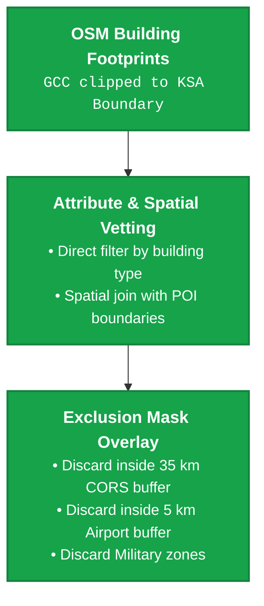
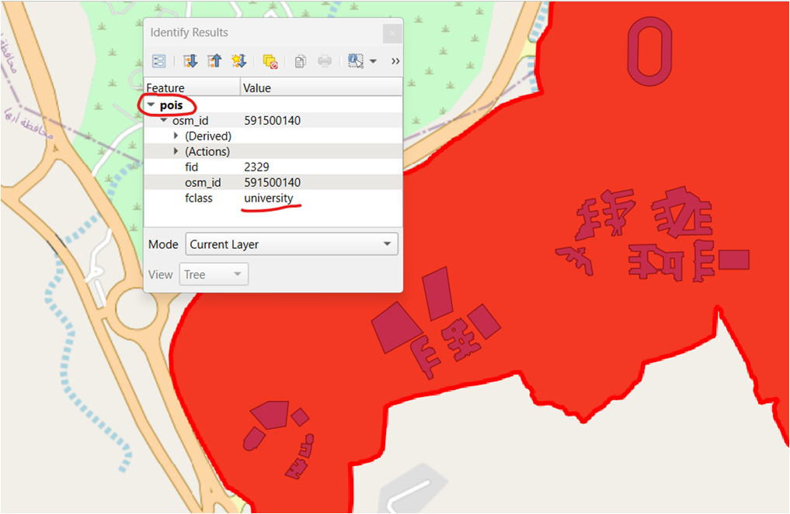
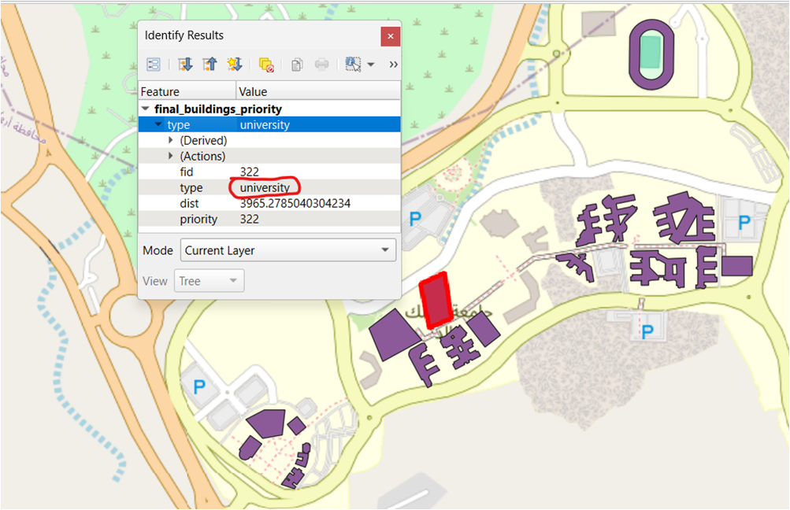
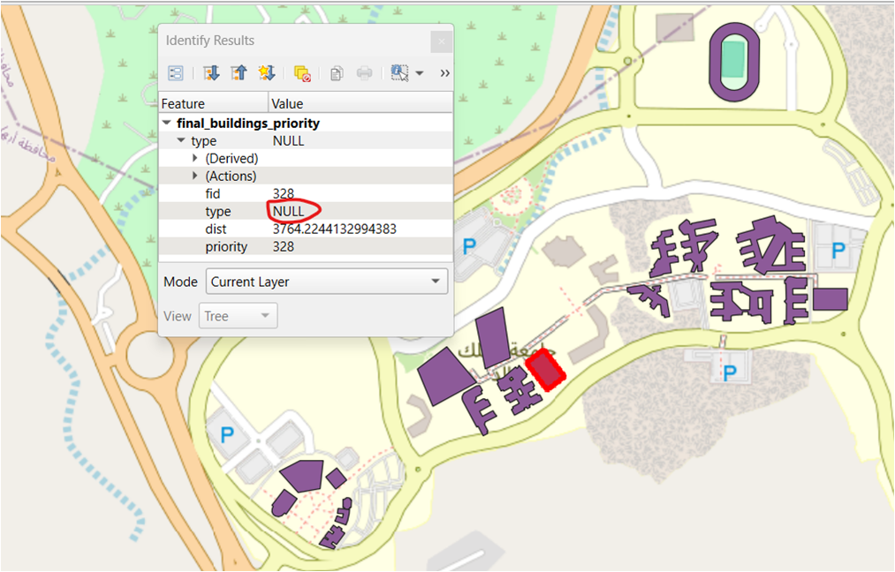
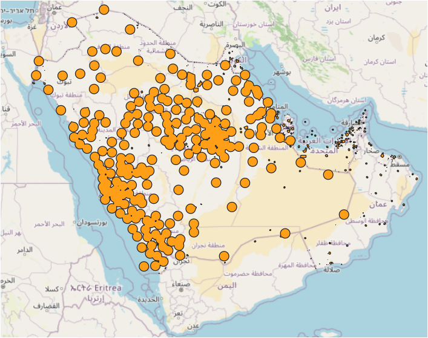
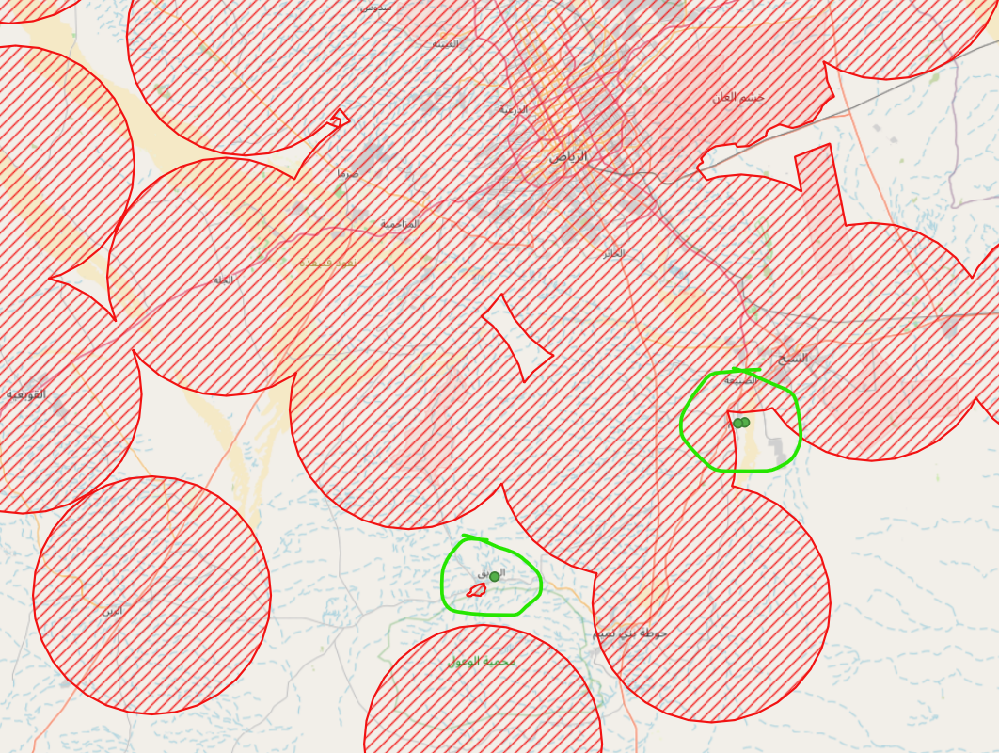
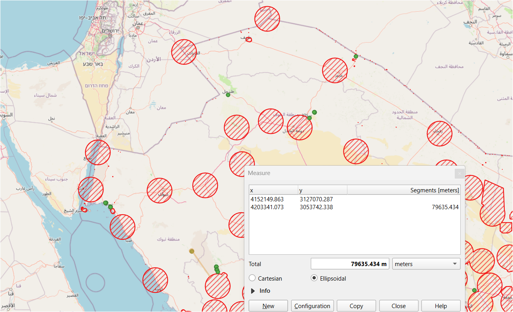

# GNSS CORS Site Selection Pipeline

An automated multi-criteria spatial analysis pipeline designed to optimize and accelerate the site selection process for new roof-type GNSS CORS (Continuously Operating Reference Stations) in the Kingdom of Saudi Arabia (KSA). This tool enables engineers and spatial analysts to identify and rank candidate buildings to densify the existing CORS network coverage.

## 📌 Overview
Selecting optimal locations for GNSS Continuously Operating Reference Stations (CORS) requires balancing complex geographic, structural, and logistical criteria. This pipeline automates the spatial analysis workflow specifically for **roof-type CORS stations** (installed on the rooftop of existing public infrastructure) to support network densification across the Kingdom of Saudi Arabia (KSA).

The workflow processes raw spatial layers, applies exclusion zones, calculates proximity factors, reprojects data for accurate geometric calculations, and ranks candidates using Multi-Criteria Decision Analysis (MCDA).

### 💡 Real-World Context & Open Data Note:

In a production/enterprise environment, GNSS CORS site selection integrates additional critical operational constraints—such as RF interference/skyline obstruction models, local multipath risks, structural engineering integrity, continuous power grid stability, and legal property access.

For demonstration and reproducible open-source purposes, this pipeline focuses primarily on key spatial and geographic criteria derived from publicly available geospatial datasets. However, the modular architecture allows seamless integration of proprietary or local infrastructure layers without altering the core pipeline code.


## 🛠️ Tech Stack

| Layer / Category | Technology / Tools |
| :--- | :--- |
| **Language** | Python 3.11 |
| **Spatial Engine & DB** | DuckDB (Spatial Extension) |
| **Geospatial Analytics** | GeoPandas, Shapely, Fiona, PyProj |
| **Data Formats & Storage** | GeoParquet, GeoPackage (GPKG), KML/KMZ, CSV |
| **Data I/O & Engineering** | Pandas, PyArrow, Requests, Urllib3 |
| **GIS Visualization & QA** | QGIS, ArcGIS Pro |

## 📑 Table of Contents
- [🏗️ Pipeline Architecture](#️-pipeline-architecture)
- [📐 Spatial MCA Methodology](#-spatial-mca-methodology)
- [⚙️ Configuration & Spatial Parameters](#️-configuration--spatial-parameters)
- [💾 Ingested Data Sources](#-ingested-data-sources)
- [🚀 Outputs & Visual Validation](#-outputs--visual-validation)
- [📁 Repository Structure](#-repository-structure)
- [🚀 Getting Started](#-getting-started)

## 🏗️ Pipeline Architecture

The application is engineered as a high-performance, modular 3-stage spatial ETL & analysis pipeline orchestrated through `src/pipeline.py` and executed via `main.py`.


### ⚙️ Stages Breakdown

#### 1️⃣ Stage 1: Fetch Data (`src/stage_01_fetch_data.py`)
> **Key Operations:** Streaming, Unzipping, File Management
* **Streaming Downloads:** Streams raw remote archives (`.zip`) from official geoportals (KSA-CORS website - National CORS network operator) and OpenStreetMap Geofabrik endpoints.
* **Memory Efficiency:** Implements chunked streaming using `8192` byte chunks alongside customizable SSL verification toggles.
* **Automated Setup:** Automatically verifies directory paths and extracts datasets directly into `data/raw/`.
---
#### 2️⃣ Stage 2: Data Preprocessing & Standardization (`src/stage_02_prepare_data.py`)
> **Key Operations:** Spatial ETL, Reprojection, GeoParquet Conversion
* **Format Parsing:** Leverages `fiona` and `geopandas` to parse heterogeneous spatial inputs, including extracting root `doc.kml` files embedded inside KMZ archives.
* **Coordinate Standardization:** Reprojects all spatial layers to a unified metric projected coordinate system (**EPSG:3857**) for precise spatial buffer calculations.
* **Optimized Storage:** Filters vector layers (KSA Boundary, Airports, Military Zones, Public Buildings, POIs, Roads) and exports them into ultra-fast **GeoParquet** files in `data/processed/`.
* **Diagnostic Logging:** Aggregates intermediate layers into a debugging **GeoPackage (`data/debug/data_preparation_debug.gpkg`)** when `EXPORT_INTERMEDIATE = True`.
---
#### 3️⃣ Stage 3: In-Memory Spatial MCA (`src/stage_03_spatial_analysis.py`)
> **Key Operations:** DuckDB SQL Vector Engine, Multi-Criteria Evaluation, Spatial Ranking
* **DuckDB Spatial Engine:** Executes vector operations entirely in-memory using DuckDB's spatial extension, leveraged with multi-threaded execution (NUM_THREADS = 8) and SQL analytical functions for distance ranking.
* **Dynamic Exclusion Surface:** Builds a dissolved exclusion surface combining:
  * Existing CORS coverage buffer (**35 km**)
  * Airport restricted buffer (**5 km**)
  * Military zone polygons
* **Accessibility Filtering:** Identifies candidate public infrastructure (schools, universities, hospitals, mosques) outside the exclusion surface and enforces road proximity constraints (**≤ 20 meters**).
* **Priority Ranking:** Ranks candidate buildings by spatial distance to current CORS network coverage using SQL window functions.
* **Multi-Format Export:** Delivers final results to `results/` as a spatial **GeoPackage (`.gpkg`)** for GIS software and a lightweight **CSV** enriched with centroid coordinates ($X, Y$).

## 📐 Spatial MCA Methodology

The Multi-Criteria Decision Analysis (MCDA) engine applies a rigorous 4-step geographic vetting process executed in-memory via DuckDB Spatial to accelerate processing performance. All distance and buffer calculations are evaluated using a metric projected coordinate system (EPSG:3857). All spatial parameters are fully configurable in src/config.py to adapt to custom deployment scenarios.

### 1. Exclusion Mask Generation (Constraint Mapping)
A dissolved spatial mask defines strict non-candidate zones by unifying three core operational constraints:
* **Existing CORS Coverage:** A **35 km** (**35,000 meters**) buffer around operational CORS stations.
  * *Domain Rationale:* While effective single-base CORS service range is ~20–30 km (with standard baseline spacing ~70 km), densification requires balancing service redundancy against capital expenditure. Placing new stations closer than 35 km to existing units creates redundant overlap without significant coverage gains.
* **Airport Safety Buffer:** A **5 km** (**5,000 meters**) safety perimeter around aviation infrastructure to eliminate potential radio-frequency (RF) interference.
* **Military Zones:** Direct polygon mask for restricted national defense territories.

---



* **Facility Criteria & OSM Data Quality Mitigation:** Public infrastructure candidates are initially filtered by primary OSM tags (school, mosque, hospital, college, university).


* **💡 Spatial Logic Solution: OSM Attribute Mitigation**
OpenStreetMap data frequently suffers from incomplete building tagging (e.g., public structures labeled `type = NULL` within hospital or university grounds). To overcome this metadata limitation, the pipeline executes a spatial intersection (`ST_Intersects`) between building footprints and validated POI boundaries. This ensures no viable public facility is omitted due to missing attribute tags.

| University Campus POI Layer | Explicitly Tagged Building | Spatial Join Retrieval (`type = NULL`) |
| :---: | :---: | :---: |
|  |  |  |
| *University campus boundary (`fclass = university`)* | *Building with explicit `university` tag* | *Building without tag (`NULL`) identified via POI boundary intersection* |

* **Constraint Elimination:** Any candidate building footprint intersecting the dissolved exclusion surface is immediately discarded using SQL spatial join logic (NOT EXISTS).


### 3. Logistical Accessibility & Maintenance Access
Surviving structural assets are evaluated against the transportation network using spatial proximity queries (ST_DWithin):
* **Road Proximity Threshold:** Structures must reside within ≤ 20 meters of a mapped road asset.
* **Engineering Rationale:** Roof-type CORS deployment involves mounting heavy metallic cabinets, UPS power units, and structural antenna masts. Long-term operational maintenance requires mobile crane access to lift equipment directly to the rooftop. Given that standard telescopic mobile cranes have an effective boom reach of 25–35 meters, a strict ≤ 20-meter road offset guarantees that service vehicles can operate directly from public roadways without physical obstruction.

### 4. Coverage Gap Priority Ranking
Candidate structures that pass all geographic and logistical constraints are ranked to maximize network expansion efficiency:
* **Distance Evaluation:** The system calculates the exact Euclidean distance (ST_Distance) from each candidate building to the aggregated coverage footprint of existing CORS stations.
* **Priority Assignment:** Candidates are ordered in descending distance sequence—assigning Priority 1 to the structure furthest from existing coverage. This ensures capital investment targets the highest-value coverage gaps first.

## ⚙️ Configuration & Spatial Parameters

All analytical parameters, thresholds, and execution flags are centralized inside `src/config.py`.

| Parameter | Value | Description |
| :--- | :---: | :--- |
| `TARGET_CRS` | `"EPSG:3857"` | Projected coordinate system for meter-based spatial buffers |
| `STATION_BUFFER` | `35000` *(35 km)* | Network densification buffer around existing CORS stations |
| `AIRPORT_BUFFER` | `5000` *(5 km)* | Aviation restriction exclusion zone |
| `DIST_TO_ROAD` | `20` *(20 m)* | Road accessibility proximity threshold |
| `NUM_THREADS` | `8` | Multi-threading allocation for DuckDB spatial engine |
| `EXPORT_INTERMEDIATE` | `True/False` | Toggle to export intermediate debug layers to GPKG |

## 💾 Ingested Data Sources

The project automatically retrieves and processes the following datasets:
1. **Official KSA-CORS network website:** Fetched directly from the [Official KSA-CORS website](https://ksacors.geoportal.sa/) (in `.kmz` format).
2. **Base Map & Regional Infrastructure:** Comprehensive OpenStreetMap layers from the [Geofabrik OSM dataset for GCC states](https://download.geofabrik.de/asia/gcc-states.html).

## 🚀 Outputs & Visual Validation

The pipeline delivers two final production outputs inside the `results/` directory:
* 📁 **`mca_final_selections.gpkg`**: A GeoPackage spatial database containing candidate structures, populated with priority rankings (`priority`) and spatial distance gaps (`dist`).
* 📊 **`mca_final_selections.csv`**: A lightweight tabular export replacing complex spatial polygons with clean **`centroid_x`** and **`centroid_y`** coordinates for direct business intelligence or API ingestion.

---

### 🗺️ Visual Verification Workflow

When `EXPORT_INTERMEDIATE = True`, the pipeline additionally exports step-by-step diagnostic layers to `data/debug/`. This enables full visual auditing of spatial logic inside GIS software like **QGIS** or **ArcGIS Pro**:

| 1️⃣ Exclusion Surface Mask | 2️⃣ Candidate Selection & Gap Filling | 3️⃣ Distance & Priority Validation |
| :---: | :---: | :---: |
|  |  |  |
| *Nationwide 35 km CORS coverage buffers combined with airport & military exclusion zones.* | *Identified candidate building clusters (green circles) to enhance network near Riyadh.* | *Spatial verification in QGIS validating priority ranking logic.* |

## 📁 Repository Structure

```text
├── data/
│   ├── raw/                # Downloaded source ZIPs, shapefiles, and KMZ files
│   ├── processed/          # Filtered layers exported as optimized .parquet
│   └── debug/              # data_preparation_debug.gpkg & spatial_analysis_debug.gpkg
├── images/                 # Screenshots of Spatial MCA results & OSM tag mitigation validation
├── results/                # Final analytical output (mca_final_selections.gpkg / .csv)
├── src/
│   ├── config.py           # Parameters, buffer distances, URLs, and paths
│   ├── pipeline.py          # Main pipeline orchestrator class
│   ├── stage_01_fetch_data.py
│   ├── stage_02_prepare_data.py
│   └── stage_03_spatial_analysis.py
├── environment.yml         # Conda environment configuration
├── requirements.txt        # Pip dependencies with frozen versions
└── main.py                 # Main execution controller entrypoint
```

## 🚀 Getting Started

### 1. Clone the Repository
```bash
git clone \\\\\\\[https://github.com/LompasAlex/gnss-cors-site-selection.git](https://github.com/LompasAlex/gnss-cors-site-selection.git)
cd gnss-cors-site-selection
```
### 2. Environment Setup (Choose One Option)

#### Option A: Using Conda (Recommended for GIS dependencies)
```bash
# Create the environment from the environment.yml file
conda env create -f environment.yml
# Activate the environment
conda activate gnss-cors-site-selection
```
#### Option B: Using standard Virtual Environment & Pip
```bash
# Create a virtual environment
python -m venv venv

# Activate the virtual environment
# On Linux / macOS:
source venv/bin/activate

# On Windows (PowerShell):
.\venv\Scripts\Activate.ps1

# On Windows (Command Prompt):
.\venv\Scripts\activate.bat

# Upgrade pip and install required dependencies
pip install --upgrade pip
pip install -r requirements.txt
```

### 3. Execution

1. **Review Configuration (Optional)**  
   Adjust spatial parameters, buffer thresholds, or thread allocations in `src/config.py` if needed:

   ```python
   CORS_BUFFER = 35000      # 35 km non-candidate redundancy buffer
   AIRPORT_BUFFER = 5000     # 5 km RF / aviation restriction perimeter
   DIST_TO_ROAD = 20        # Max distance (m) to road for crane maintenance
   NUM_THREADS = 8          # DuckDB in-memory spatial execution threads
   EXPORT_INTERMEDIATE = True # To exports step-by-step diagnostic layers
   
* **Run the Full Pipeline:**
Initiate the orchestrated 3-stage process (Data Acquisition → Preprocessing → In-Memory Spatial MCA):
```bash
python main.py
```
* **Inspect Outputs:**
Upon completion, analytical results will be available in the results/ directory:
* 📁 **`mca_final_selections.gpkg`** Spatial vector dataset for QGIS/ArcGIS
* 📊 **`mca_final_selections.csv`:** Tabular report with priority ranking and centroid $X, Y$ coordinates
